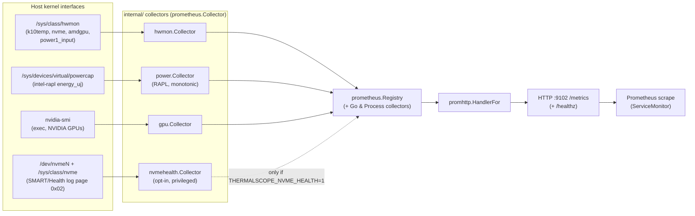

# thermalscope Architecture

## Purpose & context

thermalscope is a small, single-binary Prometheus exporter that reads a host's
thermal, power, and (optionally) NVMe wear/health sensors and exposes them as
metrics over HTTP. It is built to run as a node-level DaemonSet in the homelab
Talos/Kubernetes cluster (3 control-plane + 3 worker nodes) so that
per-node CPU/GPU temperature, RAPL energy, drive temperature, and NVMe endurance
are all visible in Prometheus/Grafana.

Design priorities, in order:

1. **Read directly from the kernel** — plain `sysfs` reads (hwmon, powercap)
   wherever possible, so the default agent needs no privileges beyond running as
   root, and no vendor tooling.
2. **Degrade, never crash** — a missing sensor tree, an absent `nvidia-smi`, or
   an unreadable RAPL root turns into a `*_up 0` gauge and zero series for that
   collector, not a failed scrape or a dead process.
3. **Correct counters** — cumulative values (RAPL energy, NVMe lifetime
   counters) are exported as genuine monotonic counters so `rate()` and long-run
   energy/cost accounting are accurate.

The binary is `cmd/agent`. Each collector is an independent package under
`internal/` implementing the `prometheus.Collector` interface; `main.go` wires
them into a registry and serves `/metrics`.

## Component & data-flow diagram



## Runtime flow, end to end

The listen address and metrics path are set in `cmd/agent/main.go`:

- **Listen address**: `THERMALSCOPE_LISTEN_ADDR`, defaulting to **`:9102`**.
- **Metrics path**: **`/metrics`** (via `promhttp.HandlerFor(reg, ...)`).
- **Health path**: **`/healthz`**, a bare `200 OK` used by the DaemonSet
  readiness probe.

Startup (`run()` in `main.go`):

1. Configure `slog` from `THERMALSCOPE_LOG_LEVEL` (`debug|info|warn|error`,
   default `info`). This is what surfaces each collector's per-domain `Debug`
   diagnostics in production.
2. Create a fresh `prometheus.NewRegistry()` (not the default global registry)
   and register: the standard `GoCollector` and `ProcessCollector`, then
   `hwmon`, `gpu`, and `power` collectors.
3. If `THERMALSCOPE_NVME_HEALTH` is truthy (`1/true/yes/on`), additionally
   register `nvmehealth.NewCollector(...)`. This is off by default because
   reading the SMART log needs `CAP_SYS_ADMIN` + `/dev/nvme*` access.
4. Serve `/metrics` and `/healthz` on an `http.Server` with a 5s
   `ReadHeaderTimeout`; block on `SIGINT`/`SIGTERM`, then graceful shutdown
   (5s timeout).

The collectors are **pull-based**: nothing is read until Prometheus scrapes
`/metrics`. On each scrape the registry calls every registered collector's
`Collect()`, which reads its sensors live and streams `prometheus.Metric`
values back over a channel. There is no background polling loop and no cached
sample — each series reflects the sensor state at scrape time.

### Per-collector behavior

**`internal/hwmon`** (`Collector`, root `THERMALSCOPE_HWMON_ROOT`, default
`/sys/class/hwmon`). Iterates `hwmon*` directories, reads each chip's `name`
file, and dispatches by chip:

- `k10temp` → `thermalscope_cpu_temperature_celsius{sensor}` (from
  `tempN_input`, millidegrees ÷ 1000; label from `tempN_label`).
- `nvme` → `thermalscope_nvme_temperature_celsius{device,sensor}` for `temp1`
  (`Composite`) and `temp2` (`Sensor1`), plus
  `thermalscope_nvme_temperature_threshold_celsius{device,sensor,level}` from
  `tempN_crit` (`level="crit"`) and `tempN_max` (`level="max"`). The threshold
  series share `device`+`sensor` labels with the temperature series so
  headroom can be computed by a PromQL join. The friendly `nvmeN` device name
  is resolved via the `hwmonN/device` symlink, with a legacy PCI-parent
  fallback and an inverse `/sys/class/nvme/*/hwmon*` walk.
- `amdgpu` → `thermalscope_amdgpu_temperature_celsius{sensor,chip_index}`
  (`chip_index` = hwmon dir basename, so multi-GPU boxes don't collide on
  identical `edge`/`junction`/`mem` labels).
- Any chip exposing `power1_input` → `thermalscope_power_watts{chip}`
  (microwatts ÷ 1e6, a gauge because `power1_input` is instantaneous).
- `thermalscope_hwmon_up` — `0` if the hwmon root is unreadable, else `1`.

**`internal/power`** (`Collector`, root `THERMALSCOPE_POWERCAP_ROOT`, default
`/sys/devices/virtual/powercap`). Walks the powercap device tree, treating any
directory that has both a `name` file and an `energy_uj` counter as a RAPL
domain. It emits `thermalscope_rapl_energy_microjoules_total{domain}` as a
**monotonic counter**: it keeps per-domain state (last raw reading + accumulated
offset) and, whenever the kernel's wrapping `energy_uj` register drops, adds
`max_energy_range_uj` to the offset so the exported value keeps climbing across
wraparound. Domains are de-duplicated by the contents of their `name` file so
the `intel-rapl-mmio` mirror does not double-count. State is mutex-guarded
because scrapes may be concurrent. `thermalscope_power_up` is `0` when the
powercap root is unreadable (RAPL is root-gated), else `1`.

> Why the non-`/sys` default matters in production: the container runtime
> (containerd) masks `/sys/devices/virtual/powercap` with an empty read-only
> tmpfs, and `/sys/class/powercap` is only relative symlinks that resolve into
> that masked tree. The DaemonSet therefore bind-mounts the real device tree at
> a non-`/sys` path (`/host/sys/powercap`) and points
> `THERMALSCOPE_POWERCAP_ROOT` at it.

**`internal/gpu`** (`Collector`). Shells out to `nvidia-smi --query-gpu=... 
--format=csv,noheader,nounits` (10s timeout) on each scrape and parses the CSV.
Emits per-GPU (`gpu` index + `name`):
`thermalscope_gpu_temperature_celsius`, `thermalscope_gpu_power_draw_watts`,
`thermalscope_gpu_sm_utilization_ratio` and
`thermalscope_gpu_memory_utilization_ratio` (percent ÷ 100),
`thermalscope_gpu_fan_speed_ratio` (percent ÷ 100), and
`thermalscope_gpu_sm_clock_hz` (MHz × 1e6). `[N/A]`/unparseable fields are
skipped. `thermalscope_gpu_up` is `0` when `nvidia-smi` is unavailable, else
`1`. (Note: AMD GPU temperature comes from the **hwmon** collector via sysfs;
this collector is the NVIDIA path.)

**`internal/nvmehealth`** (`Collector`, opt-in). Lists controllers under
`THERMALSCOPE_NVME_SYSCLASS_ROOT` (default `/sys/class/nvme`), and for each
`nvmeN` controller issues an NVMe admin **Get Log Page** ioctl (opcode `0x02`,
log id `0x02`, `NVME_IOCTL_ADMIN_CMD`) on the char device under
`THERMALSCOPE_NVME_DEV_ROOT` (default `/dev`) to read the 512-byte SMART/Health
log page. The ioctl is Linux-only (`ioctl_linux.go`; a stub in
`ioctl_other.go` keeps non-Linux builds compiling); the parser is
platform-neutral and unit-tested against a fixture. It emits per `device`:
`thermalscope_nvme_percentage_used_ratio`,
`thermalscope_nvme_available_spare_ratio`,
`thermalscope_nvme_available_spare_threshold_ratio`,
`thermalscope_nvme_critical_warning`, and lifetime counters
`thermalscope_nvme_media_errors_total`,
`thermalscope_nvme_error_log_entries_total`,
`thermalscope_nvme_power_on_hours_total`,
`thermalscope_nvme_power_cycles_total`,
`thermalscope_nvme_unsafe_shutdowns_total`,
`thermalscope_nvme_data_units_written_total`,
`thermalscope_nvme_data_units_read_total`. 128-bit little-endian counters are
decoded via `u128`. Failed or short reads are counted in
`thermalscope_nvme_read_errors_total{device}` (not silently dropped) and logged
only on the transition into/out of the failing state; disappeared devices are
pruned so series don't freeze. Blocking ioctls run in a lock-free phase; only
counter/state updates hold the mutex. `thermalscope_nvmehealth_up` is `0` when
the NVMe class dir is unreadable, else `1`.

## External integrations & dependencies

**sysfs / device paths read:**

| Path | Read by | Purpose |
| --- | --- | --- |
| `/sys/class/hwmon` | hwmon | CPU/NVMe/AMD-GPU temps, `power1_input` |
| `/sys/class/nvme` | hwmon (device-name resolution), nvmehealth (controller list) | friendly `nvmeN` names; controller enumeration |
| `/sys/devices/virtual/powercap` | power | RAPL `energy_uj` / `max_energy_range_uj` |
| `/dev/nvmeN` | nvmehealth | NVMe admin ioctl (SMART log) |
| `nvidia-smi` (PATH) | gpu | NVIDIA GPU metrics via exec |

**Go dependencies** (`go.mod`, Go 1.23) — deliberately minimal:

- `github.com/prometheus/client_golang` — registry, collector interface,
  `promhttp` handler.
- `github.com/prometheus/client_model` — pulled in by client_golang.
- Standard library for everything else (`os`, `path/filepath`, `os/exec`,
  `encoding/csv`, `encoding/binary`, `syscall`/`unsafe` for the ioctl,
  `log/slog`, `net/http`).

No config files, no database, no outbound network — the only I/O is sysfs/dev
reads, one subprocess (`nvidia-smi`), and the inbound HTTP scrape.

**Configuration (env vars):** `THERMALSCOPE_LISTEN_ADDR` (default `:9102`),
`THERMALSCOPE_LOG_LEVEL`, `THERMALSCOPE_HWMON_ROOT`,
`THERMALSCOPE_POWERCAP_ROOT`, `THERMALSCOPE_NVME_HEALTH` (opt-in switch),
`THERMALSCOPE_NVME_SYSCLASS_ROOT`, `THERMALSCOPE_NVME_DEV_ROOT`. The root
overrides exist so tests can substitute a fake `/sys` tree and so production can
escape containerd's sysfs masking.

## Key design decisions

- **One binary, many collectors, one env switch.** The same image serves both
  the unprivileged default agent and the privileged NVMe-health agent; the only
  difference is `THERMALSCOPE_NVME_HEALTH`. This keeps build/release simple and
  guarantees the two variants can never drift apart.
- **Per-scrape reads, no cache.** Collectors read live in `Collect()`. There is
  no background sampler, so there is no stale data and no goroutine to leak.
- **`*_up` gauge per collector instead of failing the scrape.** Each collector
  emits its own `_up` gauge and degrades to zero series when its source is
  absent, so one broken subsystem (no RAPL, no `nvidia-smi`) never blanks the
  others and stays independently alertable.
- **Monotonic RAPL counter over raw register.** The collector compensates for
  `energy_uj` wraparound in software rather than leaning on `rate()` to tolerate
  resets, because accurate long-run cumulative energy is the point of the
  feature.
- **Layout-agnostic discovery.** RAPL domains are found by
  (`name` + `energy_uj`) presence and de-duplicated by name; NVMe device names
  are resolved through multiple sysfs layouts. This survives kernel/vendor
  differences without hard-coded directory prefixes.
- **Non-`/sys` mount path for powercap.** A direct response to containerd
  masking `/sys/.../powercap` — documented in the code and the DaemonSet so the
  workaround isn't accidentally undone.
- **Privilege isolation for NVMe health.** SMART reads need
  `privileged: true` (the k8s device cgroup denies `/dev/nvme*` to
  non-privileged pods even with `CAP_SYS_ADMIN`), so they live in a separate
  DaemonSet rather than raising the privilege of the default agent.

## Deployment

**Image:** built and pushed to **`ghcr.io/gjcourt/thermalscope`** by
`.github/workflows/build.yml` (also the `IMAGE` default in the `Makefile`).
The `Dockerfile` is a two-stage build: `golang:1.23-bookworm` compiles a static
`CGO_ENABLED=0 linux/amd64` binary (`-trimpath -ldflags="-s -w"`), copied into
`gcr.io/distroless/static-debian12`, `EXPOSE 9102`, entrypoint
`/thermalscope-agent`. CI emits additive tags: `main`, `<sha7>`, `YYYY-MM-DD`,
the immutable `YYYY-MM-DD-<sha7>` pin, and `latest`.

CI (`build.yml`) runs on PRs and pushes to `main`: `gofmt -l` gate, `go vet`,
`go test`, and a `go mod tidy` diff check, then a buildx image job (push only
off `main`, load-only on PRs).

**Homelab GitOps** (`~/src/homelab`) deploys the same image as **two
DaemonSets** in the `thermalscope` namespace, both pinned by tag + digest:

- **`homelab/apps/base/thermalscope/daemonset.yaml`** — the default
  thermal/power agent. `hostNetwork: true`, listens on hostPort **`9102`**,
  `privileged: false`, `runAsUser: 0`, drops **all** capabilities,
  `readOnlyRootFilesystem: true`. Read-only hostPath mounts:
  `/sys/class/hwmon`, `/sys/class/thermal`, and the RAPL device tree
  `/sys/devices/virtual/powercap` mounted at the non-`/sys` path
  `/host/sys/powercap` (with `THERMALSCOPE_POWERCAP_ROOT` pointing there to
  escape containerd's tmpfs mask). Tolerates every taint (`operator: Exists`)
  so it runs on all six nodes including control-plane. Readiness probe hits
  `/healthz`; no liveness probe by design.
- **`homelab/apps/base/thermalscope-smart/daemonset.yaml`** — the NVMe-health
  variant. Sets `THERMALSCOPE_NVME_HEALTH=1`,
  `THERMALSCOPE_LISTEN_ADDR=":9103"` (hostPort **`9103`** to avoid colliding
  with the default agent's `9102` on shared nodes), and
  `THERMALSCOPE_NVME_DEV_ROOT=/host/dev`. It requires `privileged: true` (the
  device cgroup denies `/dev/nvme*` otherwise) and mounts **only** host `/dev`
  read-only at `/host/dev` — no `/sys/*` mounts, so it emits only NVMe-health
  series and never duplicates the default agent's temperature series.

Both expose headless (`clusterIP: None`) Services whose Endpoints carry host
IPs (the agents use `hostNetwork`), scraped per-node via ServiceMonitors. See
also `homelab/infra/configs/thermalscope/` (scrape config, Prometheus rules)
and `homelab/hosts/hestia/thermalscope/` (a standalone docker-compose deploy on
hestia). Bump the digest pins in the manifests — do not repoint `latest`.

## Repository layout

```
cmd/agent/            entry point: wires collectors into a registry, serves /metrics + /healthz
internal/hwmon/       CPU/NVMe/AMD-GPU temperature + power1_input from /sys/class/hwmon
internal/power/       Intel RAPL energy from the powercap device tree (monotonic counter)
internal/gpu/         NVIDIA GPU metrics via nvidia-smi (exec)
internal/nvmehealth/  NVMe SMART/health via admin ioctl (opt-in; ioctl_linux.go / ioctl_other.go)
Dockerfile            distroless static amd64 build
Makefile              build/push/test/tidy helpers
.github/workflows/    gofmt + vet + test + tidy-diff, then buildx image
```

### Note on internal architecture

`internal/` is a **flat set of independent collector packages**
(`hwmon`, `power`, `gpu`, `nvmehealth`), each implementing
`prometheus.Collector`. There is **no** `domain`/`adapters` hexagonal
separation, so no `go-arch-lint` guard is warranted here — adding one would be
inventing structure the code does not have. If the exporter later grows a
genuine ports/adapters split, revisit this.
